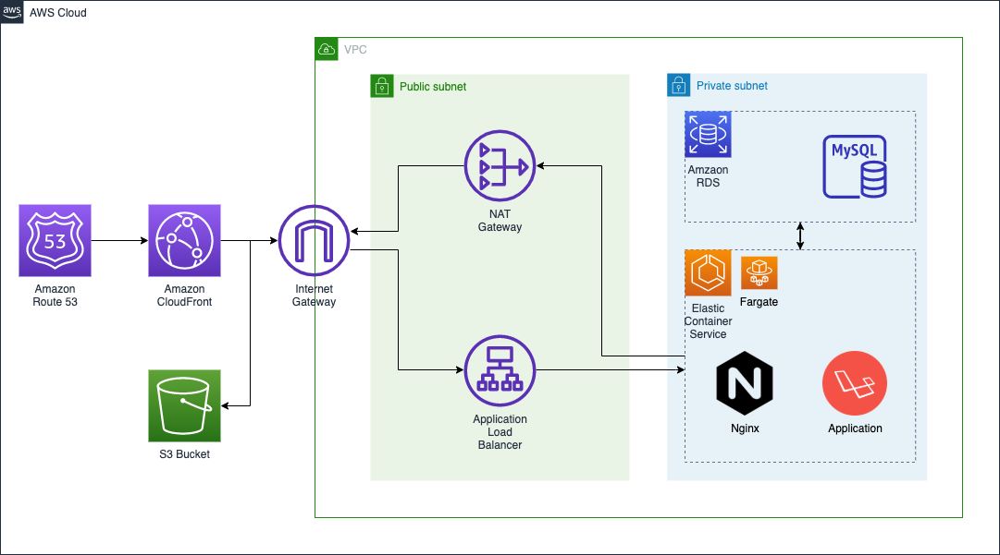
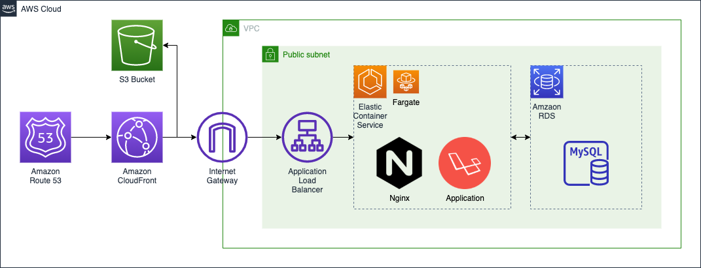

# Info

### Network Map

- Desired
  
  cost of Nat Gateway is expencive than what i expected.
  so, currently detaching nat gateway

- Current
  

### Images

- Nginx : nginx:1.18-alpine
- PHP : php:8.0-fpm-alpine
- DB : mysql:8.0
- PhpMyAdmin : phpmyadmin/phpmyadmin

# Run Locally

## Before build

_if php and composer are not installed_

- `cd ./src`
- `sudo apt install php8.0-cli`
- `sudo apt update`
- `sudo apt-get update`
- `sudo apt install composer`
- `sudo apt install php-xml`

## Build

- `composer update`
- `composer install`
- `composer dump-autoload`
- `cp .env.example .env`
- `php artisan key:generate`
- `docker-compose build`

## Run

### run docker compose

- `docker-composer up -d`

### migrate database with seed

- `docker-compose exec app ash`
- `php artisan migrate --seed`
  or
- `docker-compose exec app php artisan migrate --seed`

# After work

## Mix (css and js)

### watch

- `cd src`
- `npm run watch`

### prod

- `cd src`
- `npm run prod`

## Test

### phpcs

- `docker-compose exec app ash`
- `composer phpcs`
  or
- `docker-compose exec app composer phpcs`

### phpmd

- `docker-compose exec app ash`
- `composer phpmd`
  or
- `docker-compose exec app composer phpmd`

# Helps

### access container

run ash shell in php container

- `docker-compose exec app ash`

### when migrate or laravel features not worked

- `cd ./src`
- `composer dump-autoload`

### CSS Framework (if tailwindcss not work)

- npm install
- npm run serve

# Refer to

### CSS styles are refer from

- https://tailwindcss.com/
- https://tailwindcomponents.com/
